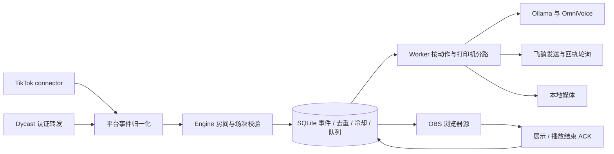

# 架构与数据契约

文档基准：2026-09-14 当前源码。根目录 `/Volumes/M2USB/Projects/ai-live-studio`。这是单机、单实例、SQLite 持久化应用，不是多节点消息系统。

## 执行链路

- `/Volumes/M2USB/Projects/ai-live-studio/src/client`：Vue3 页面、编辑器、透明展示页；正常工作台每三秒刷新状态。
- `/Volumes/M2USB/Projects/ai-live-studio/src/server/index.ts`：启动、同数据目录实例锁、待恢复数据库切换、进程信号退出。
- `/Volumes/M2USB/Projects/ai-live-studio/src/server/app.ts`：组装服务、静态页面、维护与关闭；`auth.ts` 负责认证、角色和跨站保护，`schemas.ts` 保存编辑输入契约。
- `/Volumes/M2USB/Projects/ai-live-studio/src/server/routes`：`management.ts` 管房间/规则/模板/任务，`devices.ts` 管设备/屏蔽，`data.ts` 管数据分页与导出，`operations.ts` 管备份/诊断/语音/授权，`delivery.ts` 管媒体/展示/转发。
- `/Volumes/M2USB/Projects/ai-live-studio/src/server/engine.ts`：事件验证、去重、连击结算、规则和持久化动作生成。
- `/Volumes/M2USB/Projects/ai-live-studio/src/server/worker.ts`：任务调度、预生成、打印限速、回执、语音与头像处理。
- `/Volumes/M2USB/Projects/ai-live-studio/src/server/providers.ts`：飞鹅请求、本地 AI/TTS、头像下载与凭据文件访问。
- `/Volumes/M2USB/Projects/ai-live-studio/src/server/adapters.ts`：平台地址校验、TikTok 连接、Dycast 消息适配。

## 事件与任务保证

每条事件包含 `roomId/sessionId/platform/sourceId/userId/type/origin/occurredAt`。`origin` 只允许 `live/replay/simulated`；普通模拟与回放打印强制 `dry_run`。房间、平台或场次不符会拒绝。历史消息保留记录而不触发动作；屏蔽按房间与用户生效。

事件 ID 为 origin、平台、房间、场次、来源 ID 的 SHA-256。事件、去重索引、冷却状态与动作在同一 SQLite 事务中写入；任务 ID 来自事件、规则与动作。去重独立于事件保留周期，旧事件清理不会令同一来源自动再次打印。

规则按优先级排序；关键词进行大小写与 NFKC 归一化。支持礼物 ID、最低数量、冷却、每场一次、继续匹配与点赞里程碑。模板与规则版本进入任务快照。连击使用累计最大数量，仅结束信号结算一次；缺失连击 ID 或结束事件时进入待复核状态，不猜测数量补打。

Worker 每 500ms 调度；按打印机及语音/展示分路，同一通道不并发执行。已受理打印回执按时间间隔轮询，不能阻塞其他展示。打印限速按设备尝试记录计算。欢迎任务超过两分钟会过期。AI 或语音失败保留错误；有预生成语音时可回退，回退不是原文音色质量验收。

| 状态                | 含义                                                       |
| ------------------- | ---------------------------------------------------------- |
| pending             | 等待执行，展示还需内容预处理                               |
| sending             | 正在进行外部动作；重启时打印转 unknown                     |
| ready               | 语音已生成，等待播放结束 ACK                               |
| accepted            | 打印供应商已受理，等待查询结果                             |
| completed           | 供应商回执完成，或展示/播放器 ACK；不表示人工纸面/听音验收 |
| held / blocked      | 队列保护或配置阻塞，需要处理原因                           |
| failed              | 已知失败，可按规则重试                                     |
| unknown             | 发送结果不确定，禁止自动重试打印                           |
| dry_run             | 模拟/回放打印，未发送设备                                  |
| cancelled / expired | 已取消 / 已过期                                            |

## SQLite 数据表

数据库为 `/Volumes/M2USB/Projects/ai-live-studio/var/studio.sqlite3`，启用 WAL。业务表共同结构为 `id TEXT PRIMARY KEY, data TEXT, at INTEGER`，业务字段位于 JSON；不能在迁移时把 `at` 一律当更新时间，它通常来自 createdAt/receivedAt。

| 表                | 内容及隔离依据                                              |
| ----------------- | ----------------------------------------------------------- |
| rooms             | 房间、平台、当前场次、展示 token、能力观察状态              |
| rules / templates | 房间规则与共享语言模板，带版本                              |
| printers          | 设备元数据与尾号，完整凭据独立文件保存                      |
| events            | 归一化事件，roomId/sessionId/origin                         |
| jobs              | 持久化动作、规则模板快照、providerId、parentId              |
| streaks           | 连击累计与结算状态，房间/场次/用户/礼物/连击隔离            |
| cooldowns         | 冷却及里程碑状态，房间/场次/规则/用户隔离                   |
| blockedUsers      | 房间用户屏蔽键                                              |
| access / sessions | 授权 token 哈希记录、会话哈希与到期；会话数据含访问凭据引用 |
| attempts          | 设备发送尝试及限速依据                                      |
| dedupe            | 独立持久化幂等索引，不随普通事件清理                        |
| feedback          | 预留持久化反馈数据表，是否存在业务数据以库为准              |
| settings          | `id,value`，配置、初始化标志、测试额度、媒体归属            |
| audits            | 自增 id、at、actor、action、detail、roomId；追加式操作证据  |
| migrations        | 迁移版本记录                                                |

非管理员查询先在 SQL 中按授权房间过滤，再应用分页；状态样本不会被其他房间事件挤掉。审计不按普通保留周期删除。事件清理保留被未终结任务引用的数据；媒体清理保留活跃与不确定打印任务的引用。配置默认事件 7 天、任务 90 天、媒体 24 小时；dedupe、冷却、连击及审计目前没有统一自动压缩策略，长时间运行应监测数据库体积。

## HTTP API

基址 [http://127.0.0.1:8890/api/v1](http://127.0.0.1:8890/api/v1)。JSON 错误统一 `{error:string}`。管理请求使用同源 HttpOnly 会话，脚本可用 Bearer token。普通请求体上限 256KiB，WebSocket 单帧上限同值。以下 `:id` 是资源 ID。

| 方法与路径                                         | 请求 / 返回与限制                                                                            |
| -------------------------------------------------- | -------------------------------------------------------------------------------------------- |
| GET /health、/session                              | 健康信息 / `{authenticated}`；公开                                                           |
| POST /login、/logout                               | `{token}` 创建 12h 会话 / 销毁当前会话                                                       |
| GET /state                                         | rooms、rules、templates、printers、events、jobs、audits、settings、role、blockedUsers、stats |
| GET /stream                                        | SSE 变化提示，客户端再获取状态                                                               |
| POST /rooms；PATCH /rooms/:id                      | 新建 / 修改房间；新建及重绑打印机仅管理员                                                    |
| POST /rooms/:id/connect、/disconnect、/new-session | 连接 / 断开 / 创建新场次                                                                     |
| POST /rules；PATCH、DELETE /rules/:id              | 房间规则增改删；模板须存在，不能借修改跨房间移动规则                                         |
| POST /templates；PATCH /templates/:id              | 管理员编辑共享模板                                                                           |
| POST /preview、/simulate                           | 实验室事件；预览无业务写入，模拟持久化且禁止普通实体打印                                     |
| POST /replay                                       | `{roomId,eventIds}`，最多100条，所有事件必须属于该房间                                       |
| POST /jobs/:id/cancel、/retry、/reprint            | 安全取消/失败重试/管理员独立补打；未知打印不能 retry                                         |
| POST /printers；PATCH /printers/:id                | 管理员配置设备；sn/user/ukey 写入凭据文件且不返回                                            |
| POST /printers/:id/check、/test                    | 状态查询 / `{text,language}` 单张测试；安装额度十张                                          |
| POST、DELETE /blocked-users                        | `{roomId,userId}`，指定房间屏蔽或解除                                                        |
| POST /settings                                     | 管理员修改配置；AI 地址只接受本机 Ollama 地址                                                |
| GET /events、/jobs、/fans                          | `?roomId=&limit=&offset=`；默认100、上限1000；返回 `{items,total,limit,offset}`              |
| GET /export                                        | `?kind=events\|jobs\|fans&roomId=`；流式全量 CSV，UTF-8 BOM，公式注入防护                    |
| POST /backup、/restore                             | `{name}` 备份文件 / `{name}` 请求恢复，恢复返回 restartRequired                              |
| GET /diagnostics                                   | `{checks:[{name,status,detail}]}`，诊断可达/配置不等于端到端验收                             |
| POST /speech/preview                               | `{roomId,text}`，最长80字符；`{url,status,error?}`                                           |
| GET、POST /access                                  | 管理员列出脱敏授权 / `{role,roomIds}` 发放 token                                             |
| GET /overlay/:id                                   | 房间展示 token 查询，返回 room/jobs/settings；最多30任务                                     |
| POST /overlay/:id/ack                              | `{jobId}`；只确认当前房间、场次与待完成展示/语音，暂停时拒绝                                 |
| GET /media/:name                                   | 管理员或授权房间访问；展示请求附 roomId 与 token                                             |
| GET /relay-config/:id                              | 管理员读取本机认证转发 URL                                                                   |
| WebSocket /relay/:id                               | token 必须在升级前验证；只允许抖音房间，先发房间信息再发消息数组                             |

状态样本为最近300事件、500任务、150审计。`stats.events/jobs/gifts` 使用完整授权历史；`gifts` 累加匹配礼物数量，不是礼物金额。`pending` 合并 pending/ready/sending/accepted/held；`failed` 合并 failed/unknown/blocked，另给 blocked、unknown、cancelled、dryRun 明细。粉丝按 roomId/platform/userId 聚合，计事件、匹配礼物数量、评论和关注事件次数，昵称取最近事件；这些不是平台权威粉丝总数。
